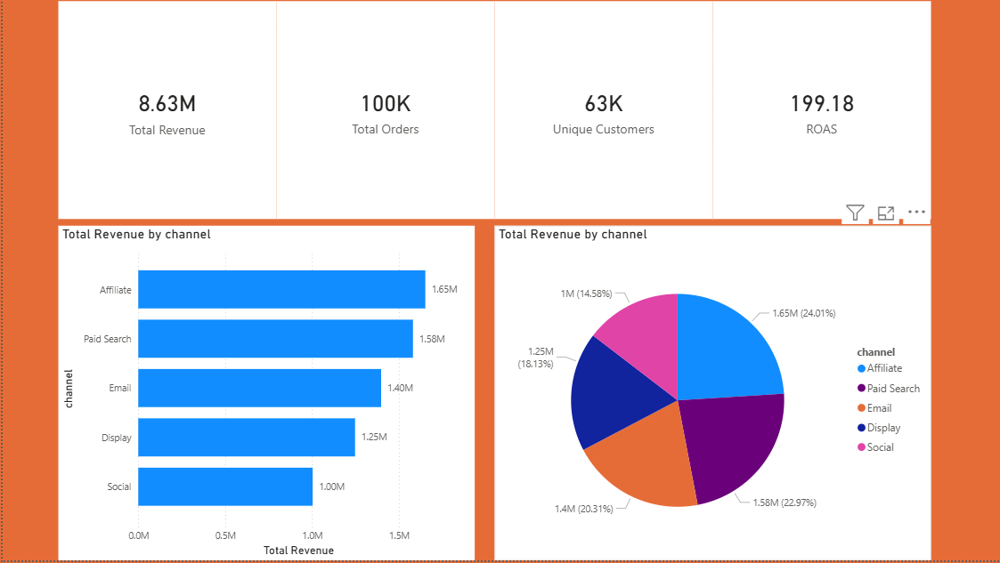

# Marketing-Attribution-ROI-Dashboard
Multi-Touch Marketing Attribution and ROI Analysis using Python, SQL, SQLite, and Power BI.
## Week 1 Work
This week focuses on data ingestion and exploratory data analysis.
Tasks include:
- checking missing UTM values
- standardizing timestamps
- removing duplicate user IDs
## Week 1 Work
This week focuses on data ingestion and exploratory data analysis.
Tasks include:
- checking missing UTM values
- standardizing timestamps
- removing duplicate user IDs.
- # Project 1: Multi-Touch Marketing Attribution ROI Dashboard

## Overview
This project analyzes marketing channel performance and builds an executive dashboard to compare revenue contribution across channels. The goal is to support better budget allocation using clear KPI cards and channel-level visuals.

## Tools Used
- Python
- SQL
- Power BI
- Jupyter Notebook

## Project Structure
- `notebooks/` — weekly analysis notebooks
- `src/` — reusable Python scripts
- `sql/` — SQL queries and table scripts
- `dashboards/` — Power BI dashboard files
- `docs/` — work logs and team documents
- `assets/` — screenshots and exported visuals

## Weekly Work Summary
### Week 1
Data cleaning, EDA, missing value checks, and dataset understanding.

### Week 2
SQL joins, attribution logic, and data transformation.

### Week 3
Metric calculations such as revenue, orders, unique customers, and ROAS.

### Week 4
Dashboard creation in Power BI with KPI cards and channel comparison visuals.

## Key Dashboard Metrics
- Total Revenue.
- Total Orders.
- Unique Customers.
- ROAS.

## Visuals Included
- KPI cards
- Channel revenue bar chart
- Channel revenue pie chart.

## GitHub Notes
- Raw datasets are excluded using `.gitignore`.
- Notebook outputs should be cleared before committing.
- Commits should be made regularly and linked to issue numbers.

## How to Reproduce
1. Open the notebook files.
2. Run the data preparation steps.
3. Review the SQL scripts.
4. Open the Power BI dashboard file and refresh the data model if needed.

## Business Insights
- Identify the highest-performing channel by revenue.
- Compare contribution across channels.
- Support marketing budget decisions with clear KPI reporting.
## Dashboard Preview

